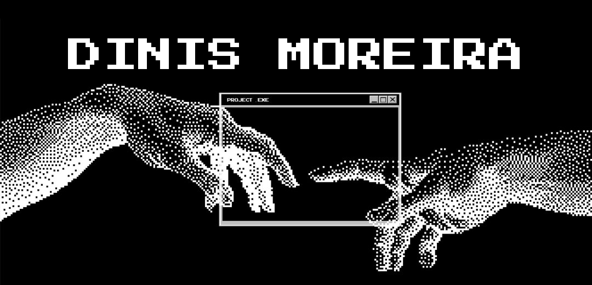

---

<h2 align="center">🙋‍♂️ Sobre mim</h2>

🎓 Estudante de **Programação** na escola profissional **Oficina** 
🛼 **Treinador de patinagem** no clube **CART** desde setembro de 2025 
🎮 Adoro **programar e jogar** nos tempos livres 
😄 Divertido, sociável e sempre a aprender 
📍 Santo Tirso, Portugal

O meu objetivo é simples: escrever código limpo, criar bons jogos e software e crescer até me tornar programador profissional.

<h2 align="center">🎯 Objetivos</h2>

🎮 **Desenvolvimento de jogos** &nbsp;·&nbsp; 💻 **Desenvolvimento de software**

---

<h2 align="center">🛠️ Skills</h2>

 

---

<h2 align="center">🚀 Projetos</h2>

| Projeto | Descrição |
|:--|:--|
| ⭕ **Jogo do Galo** | O clássico jogo, feito de raiz |
| ➕ **Calculadora** | Calculadora funcional |
| 🔤 **Termo** | Jogo de adivinhar palavras ao estilo Wordle |
| 🌍 **Nacionalipho** | Projeto pessoal |

👉 [**Ver todos os repositórios**](https://github.com/Squi1ck?tab=repositories)

---

<h2 align="center">🌍 Idiomas &amp; 🤝 Soft Skills</h2>

<table>
<tr>
<td width="50%" valign="top">

### 🗣️ Idiomas
🇵🇹 Português — `Nativo` 
🇬🇧 Inglês — `Avançado` 
🇪🇸 Espanhol — `Intermédio`

</td>
<td width="50%" valign="top">

### 💡 Soft Skills
✅ Trabalho em grupo 
✅ Capacidade de comunicação 
✅ Organização 
✅ Facilidade em adaptar-me

</td>
</tr>
</table>

---

<h2 align="center">🐍 Contribuições</h2>

<picture>
  <source media="(prefers-color-scheme: dark)" srcset="https://raw.githubusercontent.com/Squi1ck/Squi1ck/output/snake-dark.svg">
  <source media="(prefers-color-scheme: light)" srcset="https://raw.githubusercontent.com/Squi1ck/Squi1ck/output/snake.svg">
  
</picture>

---

*⭐ Obrigado por passares pelo meu perfil!*

